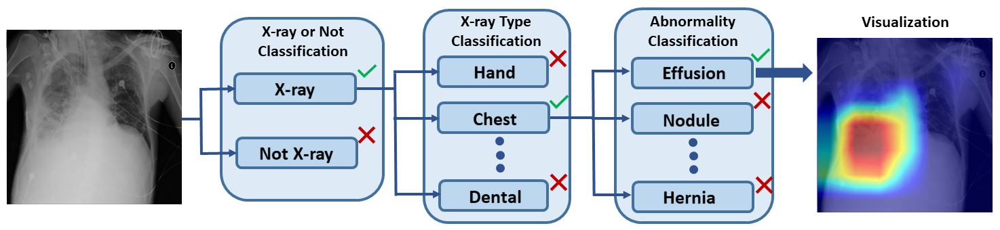
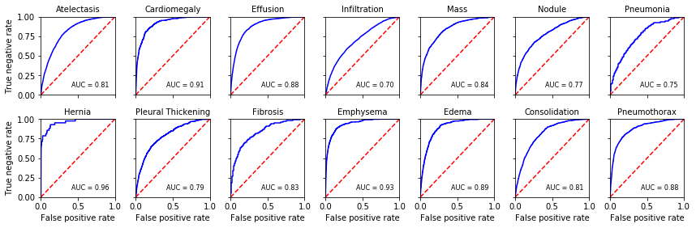

# Chest X-ray module

This is the code for training the model for ```Module 3``` of this [paper](https://arxiv.org/ftp/arxiv/papers/2003/2003.08605.pdf). 
The paper was admitted to [EMBC 2020](https://embc.embs.org/2020/) and will be published soon.

The pipeline of the system from the paper is below. ```Module 3``` is Abnormality classification. The visualization was done using [Grad-Cam](https://arxiv.org/abs/1610.02391).



## Install
```pip install -r requirements.txt```

## Training
Download [images](https://nihcc.app.box.com/v/ChestXray-NIHCC) and put all of them in the [overall](overall) directory.
To run the training with default options, simply run `python train.py`
#### Flags
- `--cfg`: Experiment configure file name
- `--checkpoint`: Experiment checkpoint file name
- `--sp`: Run the program using a single process. Windows users need to turn this flag on.
- `--detector`: Detector you can use, yolo/tracker.

After in the training ```logs``` directory will be created. The model weights can be found in ```logs/experiment_name/checkpoints```.

## Test

The evaluation Jupyter notebooks of the model on the test and validation data are [here](inference).

The AUC score of the model on the test data is provided below.



## Note
If you use this code in research, please cite the following paper:
```
@misc{2003.08605,
Author = {Kudaibergen Urinbayev and Yerassyl Orazbek and Yernur Nurambek and Almas Mirzakhmetov and 
          Huseyin Atakan Varol},
Title = {End-to-End Deep Diagnosis of X-ray Images},
Year = {2020},
Eprint = {arXiv:2003.08605},
}
```


